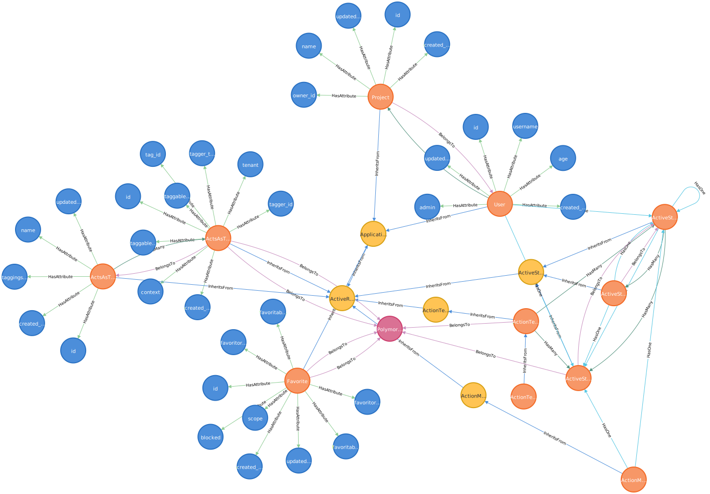

# Installation

Start databases using docker compose:

```bash
docker compose up
```

Migrate the development database:

```bash
rails db:reset
```

Export the data model to Neo4j database run:

```bash
rails rails_graph:export:neo4j -- -u neo4j -p admin -h neo4j://localhost:7687
```
